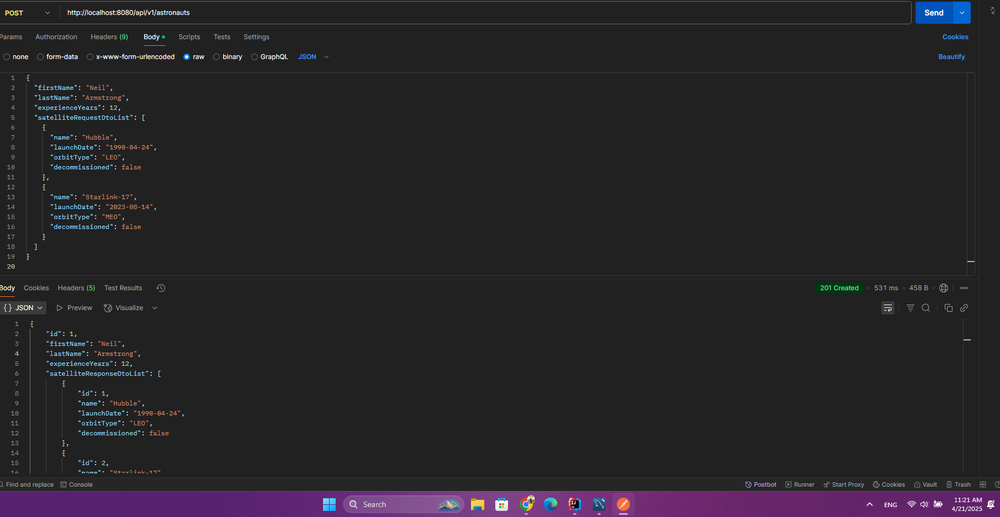
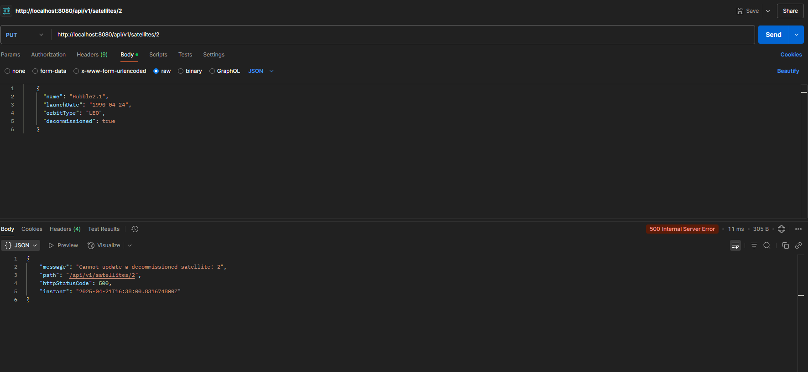
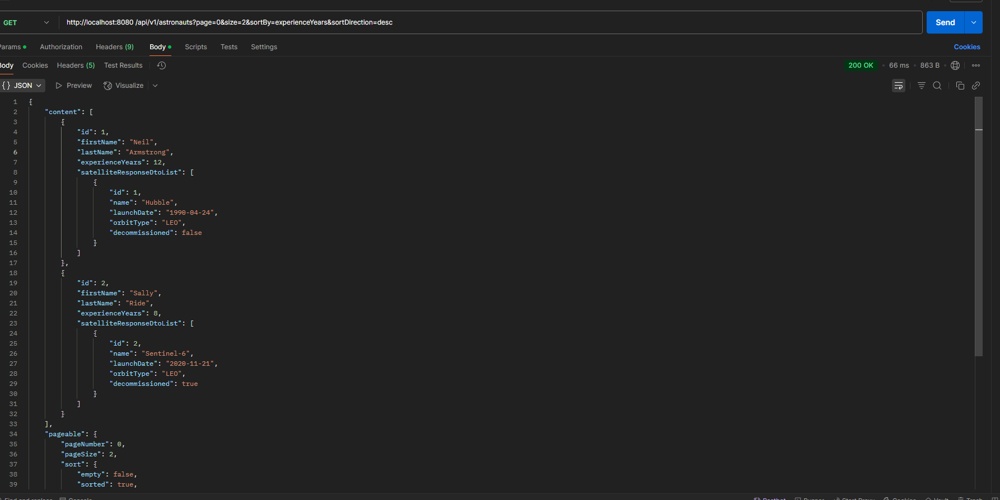
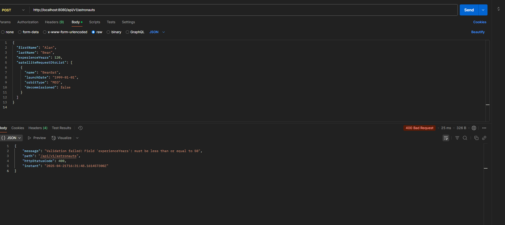
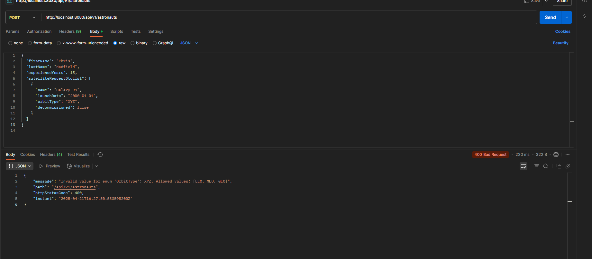
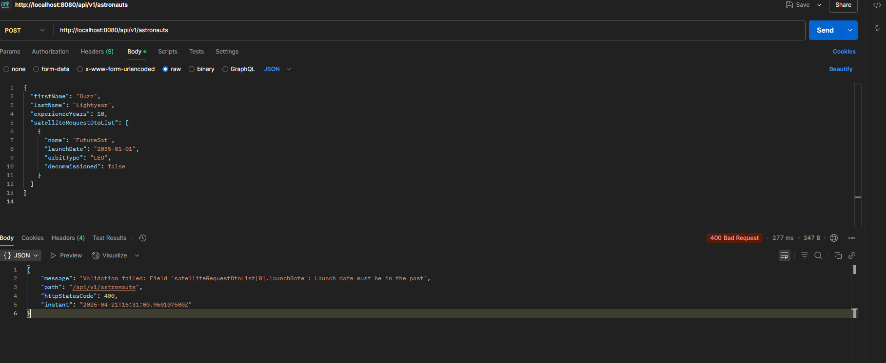
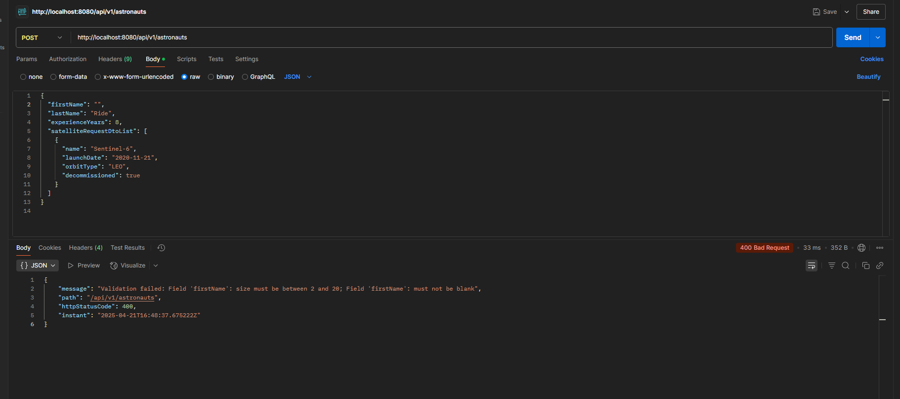
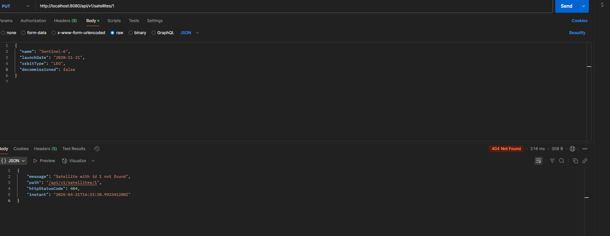

# API Test Cases & Screenshots

This section documents the tested API endpoints for the **Satellite-Astronaut Tracking System** with appropriate screenshots and descriptions.

---

## 📅 1. Create Astronaut

### Endpoint
```http
POST /api/v1/astronauts
```
### Description
Creates a new astronaut with assigned satellites.



---

## ❌ 2. Cannot Assign Decommissioned Satellite

### Endpoint
```http
POST /api/v1/astronauts
```
### Description
Throws a validation error if any satellite in the request is decommissioned.



---

## 🔄 3. Get Sorted Astronauts

### Endpoint
```http
GET /api/v1/astronauts?sort=experienceYears&sortDirection=desc
```
### Description
Returns all astronauts sorted by experience.



---

## ❌ 4. Invalid Experience Years

### Endpoint
```http
POST /api/v1/astronauts
```
### Description
Experience must be between 0 and 50.



---

## ❌ 5. Invalid Orbit Type (Enum)

### Endpoint
```http
POST /api/v1/astronauts
```
### Description
Orbit type must be one of: `LEO`, `MEO`, `GEO`.



---

## ❌ 6. Invalid Launch Date (Must be in the Past)

### Endpoint
```http
POST /api/v1/astronauts
```
### Description
Launch date must be in the past.



---

## ❌ 7. Validation: First Name Not Blank

### Endpoint
```http
POST /api/v1/astronauts
```
### Description
First name must not be blank.



---

## ❌ 8. Satellite Not Found

### Endpoint
```http
PUT /api/v1/satellites/PlutoSat
```
### Description
Throws `SatelliteNotFoundException` when trying to update a non-existent satellite.



---

> All screenshots are saved under the `screenshots/` directory and captured using Postman.

